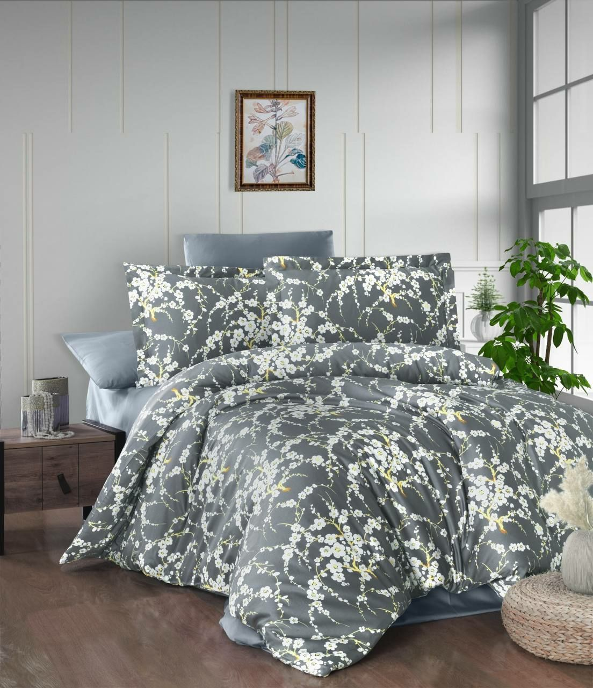
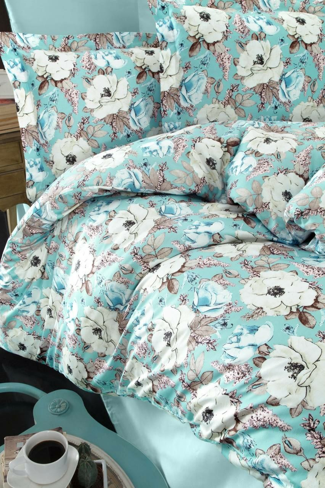
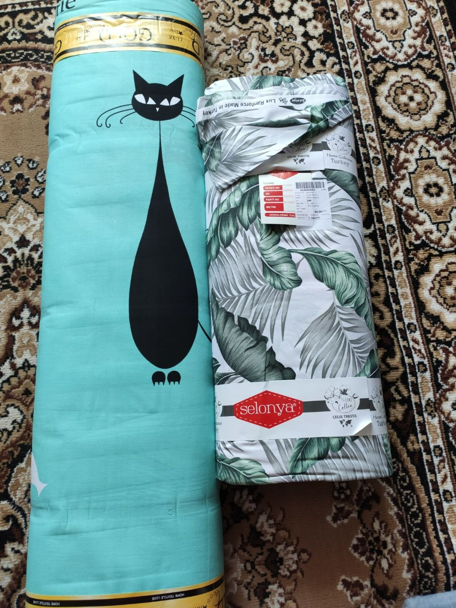
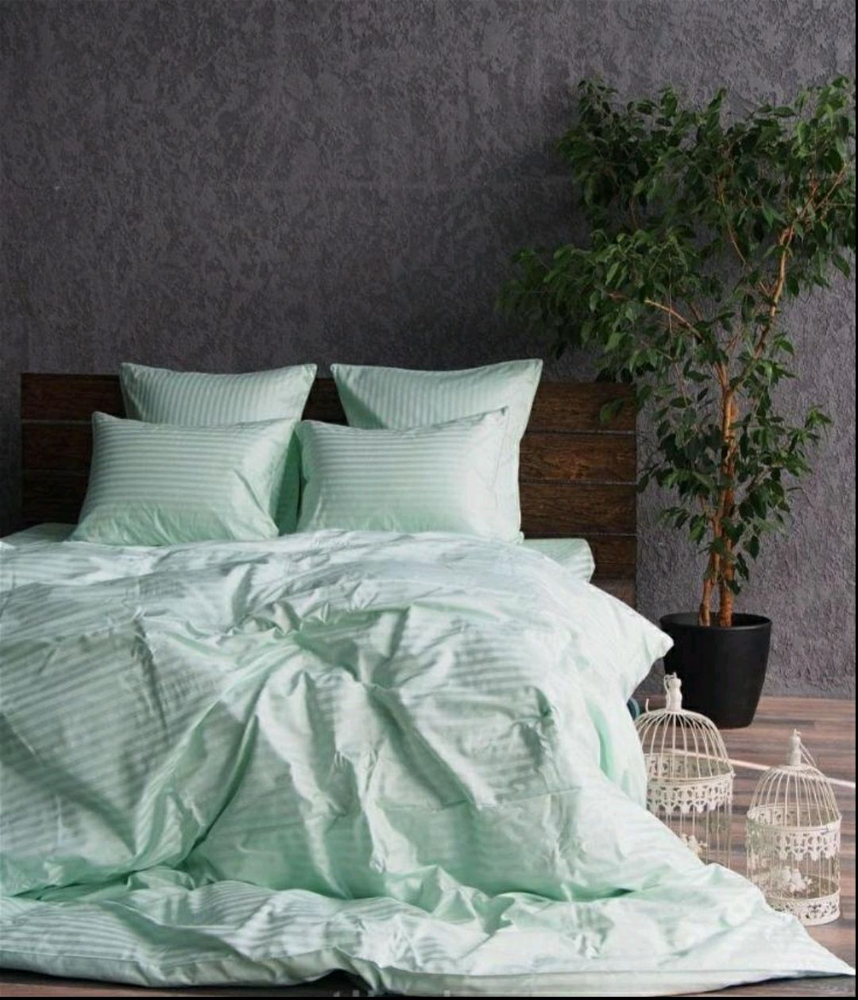
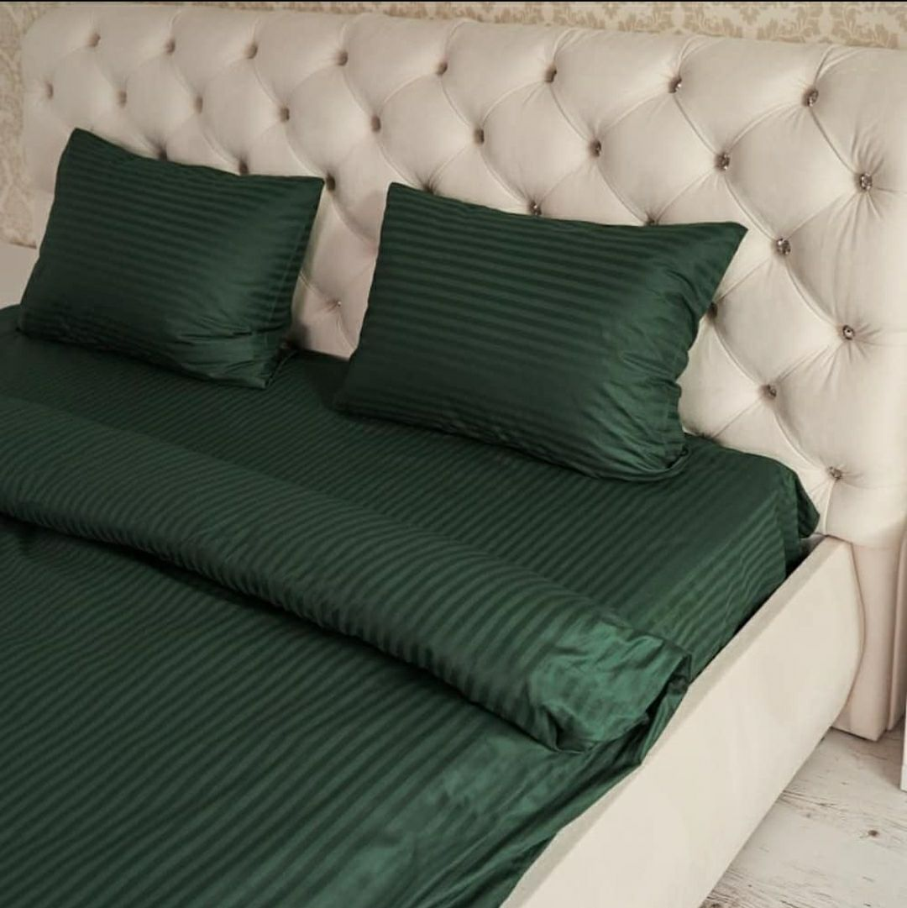

= Марусины чудеса
Марина Поскочина <marina.valerievna.18@gmail.com>
//3.0, July 29, 2022: AsciiDoc article template
:toc:
:toc-title: Содержание
//:icons: font
//:url-quickref: https://docs.asciidoctor.org/asciidoc/latest/syntax-quick-reference/

//Content entered directly below the header but before the first section heading is called the preamble.

== Правила

. Основные
.. Продукция шьется на заказ по вашим размерам.
.. В целях экономии ваших средств, когда набирается минимум три заказа на конкретный рулон ткани,
   покупается целый рулон по оптовой цене и шьется всем заказавшим
.. Если нужно пошить что-то непопулярное, на что не набрался минимум заказов, есть возможность
   купить эту ткань для Вас индивидуально, но цена на ткань будет розничная, стоимость работ
   останется той же.

//== Таблица размеров
//
//NOTE: При измерении своей постели используйте рулетку! :)
//
//.Table Размеры
//|===
//|Размер |Значение
//
//|1
//|1*1
//
//|2
//|2*2
//|===

== Постельное белье

Мы можем вам предложить следующие ткани

=== Маленькие ромашки

=== Большие ромашки

=== Котики

Эта ткань - лидер заказов!

=== Полоска

=== Зеленая полоска

=== Белые котики

image::[]

//== Полезные цитаты
//
//[quote,Марина,Супер швея]
//____
//Если вас что-то не устраивает, дорога всегда открыта :)
//____
